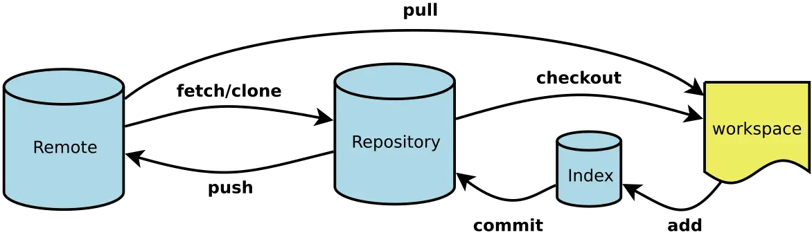

# Operation Manual

## Introduction



- Workspace: 本地电脑存放项目文件的地方
- Repository: 使用commit命令将index中的文件添加到本地仓库中
- Index: 暂时存放文件的地方, 在.git文件夹中
- Remote: 项目代码在远程git服务器上, 使用clone命令将远程仓库拷贝到本地仓库中, 开发后推送到remote中

## Operation Instructions

1. 新建仓库

   ```git
   新建本地仓库: git init
   从远程克隆项目: git clone <url>
   ```

2. 提交
   ```git
   提交workspace所有文件到index: git add.
   将index中文件提交到repository: git commit -m "commit_info"
   撤销上次提交: git commit --amend
   ```

3. 查询
   ```git
   查询workspace所有文件状态: git status
   ```

4. 分支管理
   ```git
   向remote上推送内容: git push
   ```

   

